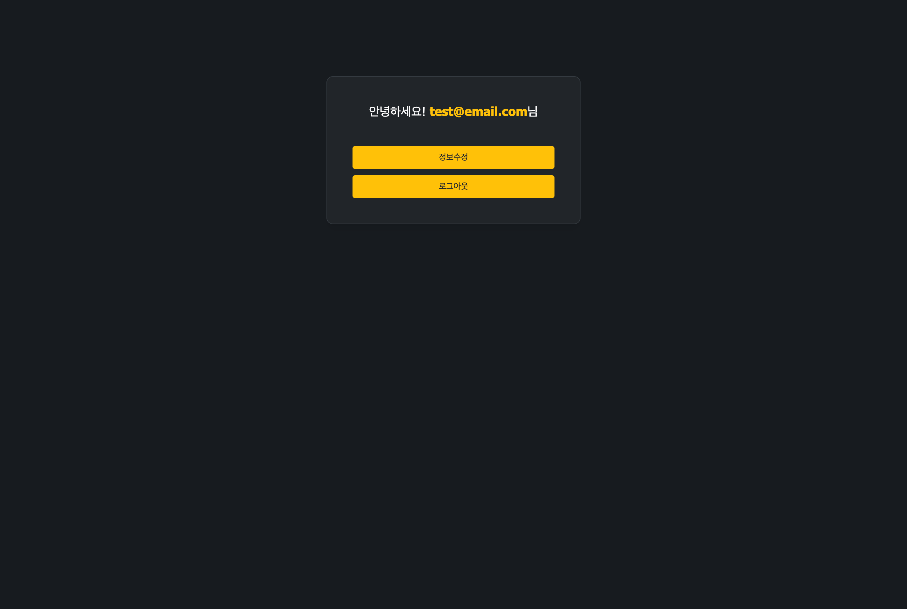
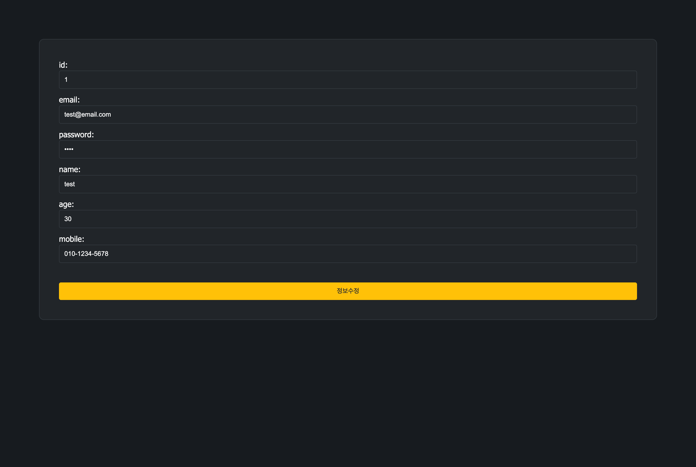
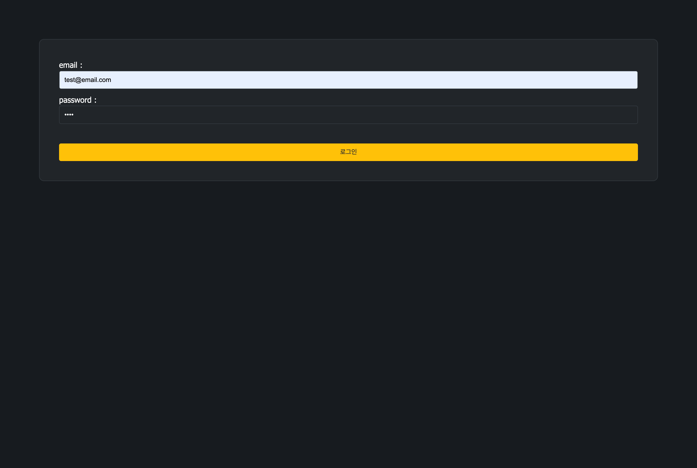
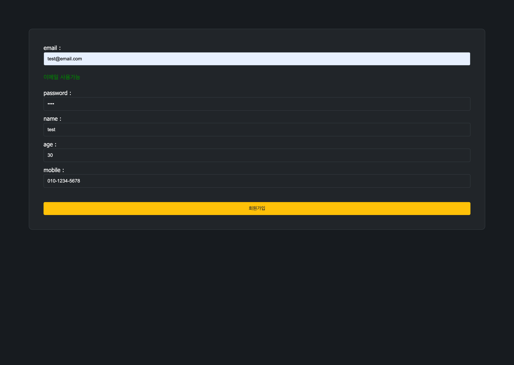
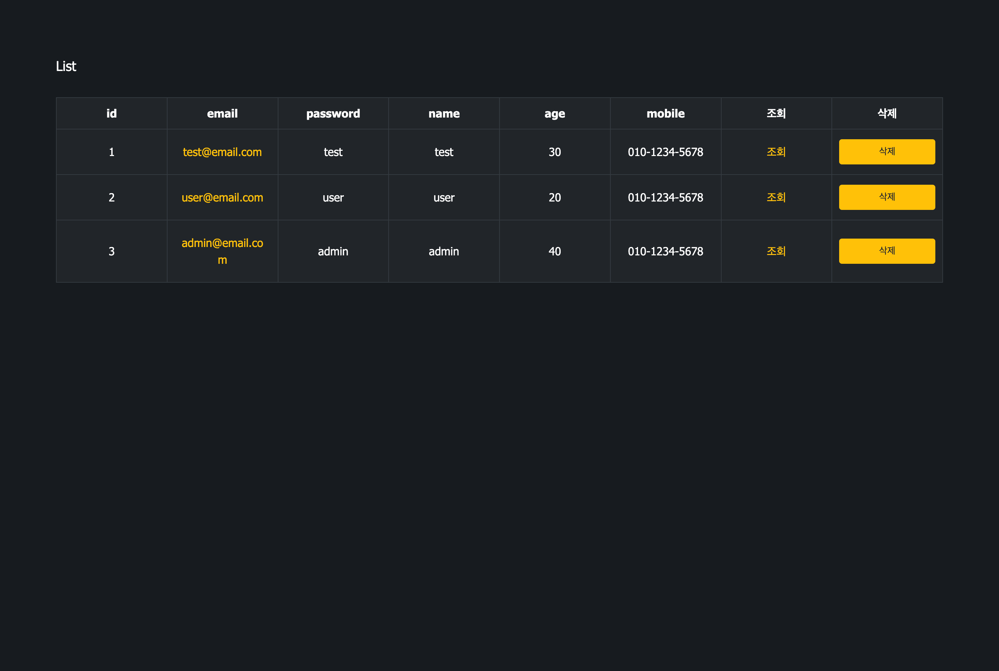
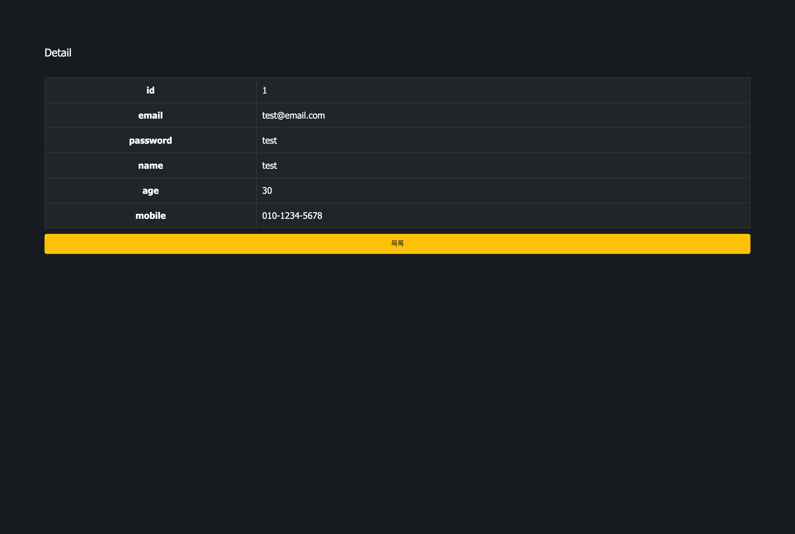
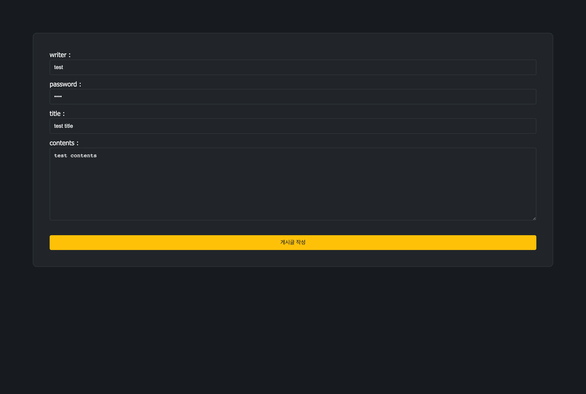
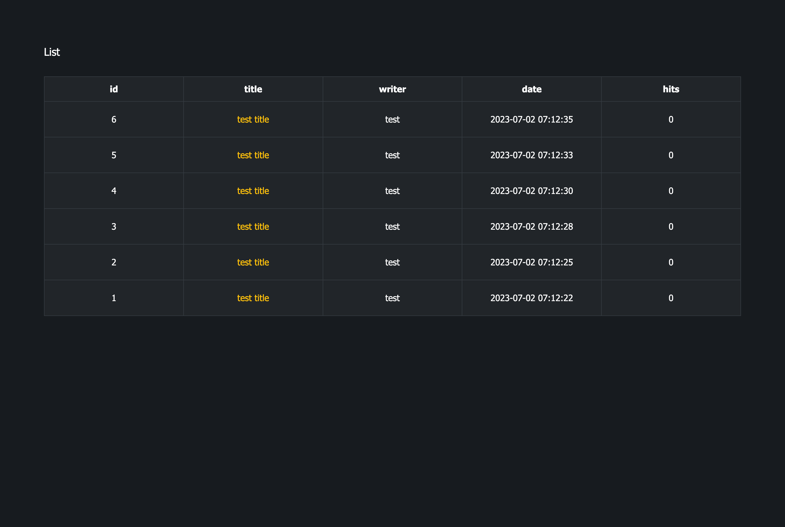
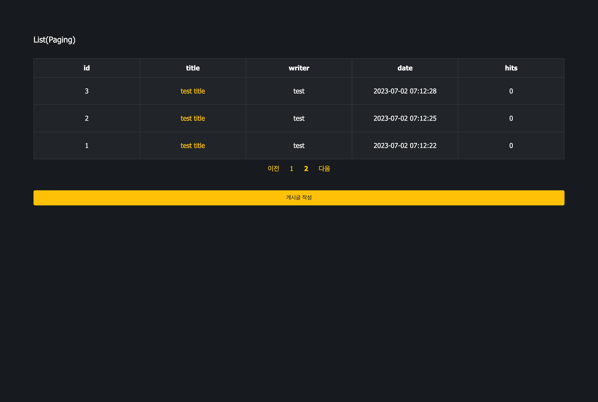
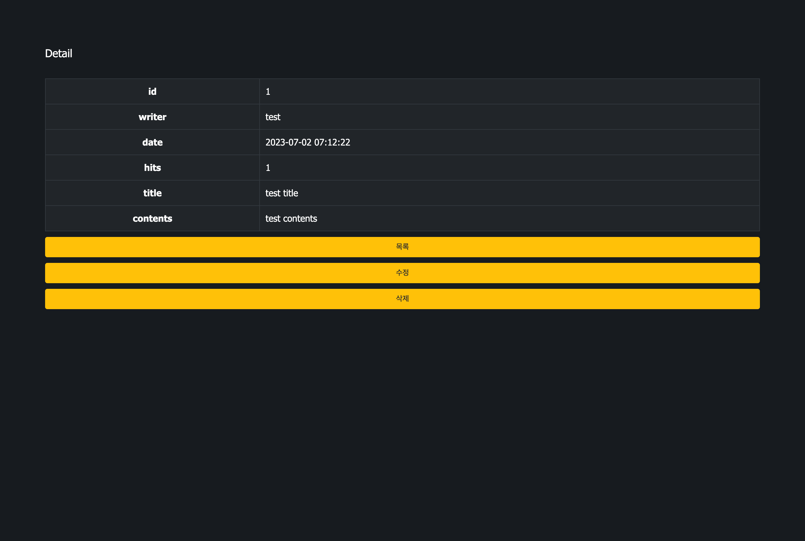

# spring-framework-board-sample
> Spring Framework Board Sample.

<br>

## Development Environment
<div style="display: inline-block">
    
    
    
    
    
    
    
    
    
</div>

- IDE : IntelliJ IDEA
- Language : HTML5, CSS3, JavaScript (ES6), JAVA 11 (JDK 11.0.18)
- Library : jQuery 3.6.3
- Framework : Spring Framework 5.3.20, MyBatis 3.5.6
- Build Tool : Maven 3.8.0
- DBMS : MySQL 8.0.31 for Linux
- WAS : Apache Tomcat 9.0

<br>

## Main Function
- 회원(member)
    - 로그인(login) : /member/login
    - 로그아웃(logout) : /member/logout
    - 회원가입(join) : /member/join
    - 회원목록(list) : /member/
    - 회원정보 조회(detail) : /member/{id}
    - 회원정보 수정(update) : /member/update
    - 회원정보 삭제(delete) : /member/delete/{id}

- 게시판(board)
  - 게시글 작성(write) : /board/write
    - 게시글 목록(list) : /board/
    - 게시글 조회(detail) : /board/{id}
    - 게시글 수정(update) : /board/update/{id}
    - 게시글 삭제(delete) : /board/delete/{id}
    - 게시글 페이징(paging) : /board/paging
        - /board/paging?page=1

<br>

## Add Function
- 회원(member)
    - ajax 이메일 중복체크 : /member/email-check

<br>

## Create MySQL Database
```SQL
create database springframework_board;
create hoong@localhost identified by '8888';
grant all privileges on springframework_board.* to hoong@localhost;
```

<br>

## MySQL Database Table
```SQL
/* 회원 */
drop table if exists springframework_board.member;

create table springframework_board.member (
    id             bigint primary key not null auto_increment,
    memberEmail    varchar(20) unique null,
    memberPassword varchar(20) null,
    memberName     varchar(20) null,
    memberAge      int         null,
    memberMobile   varchar(30) null
);


/* 게시판 */
drop table if exists springframework_board.board;

create table springframework_board.board (
    id               bigint primary key not null auto_increment,
    boardWriter      varchar(50)            not null,
    boardPassword    varchar(20)            null,
    boardTitle       varchar(50)            null,
    boardContents    varchar(500)           null,
    boardHits        int default 0          null,
    boardCreatedTime datetime default now() null
);
```

<br>

## View
###### Index


###### Member - Main (After Login) & Update



###### Member - Login


###### Member - Join


###### Member - List & Detail



###### Board - Write & Update



###### Board - List & Paging & Detail



